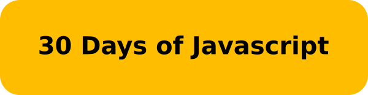

<h4 align=center>
30 days of JavaScript programming challenge is a step-by-step guide to learn JavaScript programming language in 30 days.
This challenge may take more than 100 days, but I finished it in just a week.
<h4>

<table>
<tr>
<th>
TOPIC
</th>
<th>
SOLUTION
</th>
</tr>
<tr>
<td>
Introduction
</td>
<td>
 <a href="./01">01</a>
</td>
<tr>
<td>
Data Types
</td>
<td>
 <a href="./02">02</a>
</td>
</tr>
<tr>
<td>
Boolean, Operators, Date
</td>
<td>
 <a href="./03">03</a>
</td>
<tr>
<tr>
<td>
Conditionals
</td>
<td>
 <a href="./04">04</a>
</td>
<tr>
<tr>
<td>
Arrays
</td>
<td>
 <a href="./05">05</a>
</td>
<tr>
<tr>
<td>
Loops
</td>
<td>
 <a href="./06">06</a>
</td>
<tr>
<tr>
<td>
Functions
</td>
<td>
 <a href="./07">07</a>
</td>
<tr>
<tr>
<td>
Functions
</td>
<td>
 <a href="./08">08</a>
</td>
<tr>
</table>
